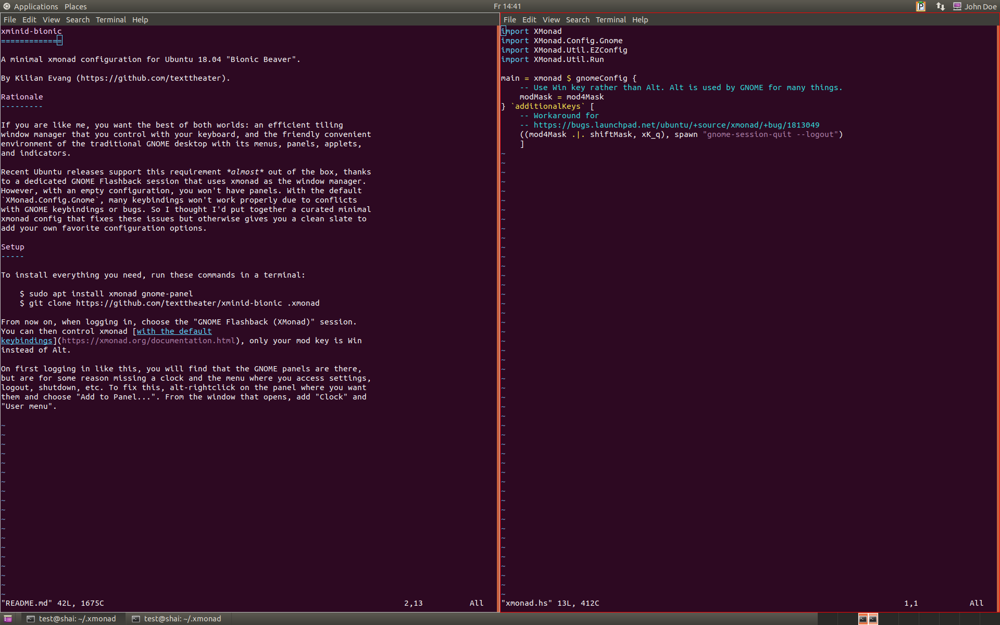

xminid
======

A minimal xmonad configuration with panels for Ubuntu 18.04 “Bionic Beaver” and
Ubuntu 20.04 “Focal Fossa”.

By [Kilian Evang](https://github.com/texttheater).

Rationale
---------

If you are like me, you want the best of both worlds: an efficient tiling
window manager that you control with your keyboard, and the friendly convenient
environment of the traditional GNOME desktop with its menus, panels, applets,
and indicators.

Recent Ubuntu releases support this requirement *almost* out of the box, thanks
to a dedicated GNOME Flashback session that uses xmonad as the window manager.
However, with an empty configuration, you won't have panels. With the default
`XMonad.Config.Gnome`, there are still some unacceptable problems:

* Many keybindings won't work properly due to conflicts with GNOME keybindings
  or bugs.
* Applications going fullscreen (like media players or browsers) is not
  supported.

So I thought I'd put together a curated minimal xmonad config that fixes these
issues but otherwise gives you a clean slate to add your own favorite
configuration options.

Setup for Ubuntu 18.04
----------------------

To install everything you need, run these commands in a terminal:

    $ sudo apt install xmonad gnome-panel
    $ cd
    $ git clone https://github.com/texttheater/xminid-bionic .xmonad

From now on, when logging in, choose the *GNOME Flashback (Xmonad)* session.

Setup for Ubuntu 20.04
----------------------

For Ubuntu 20.04, the procedure is slightly more complex: due to a
[bug](https://bugs.launchpad.net/ubuntu/+source/xmonad/+bug/1919089), the
*GNOME Flashback (Xmonad)* session does not work. I recommend you use [Gekkio’s
Gnome + XMonad](https://github.com/Gekkio/gnome-session-xmonad) session
instead. The complete setup procedure then is:

    $ sudo apt install xmonad gnome-panel
    $ sudo add-apt-repository ppa:gekkio/xmonad
    $ sudo apt update
    $ sudo apt
    $ cd
    $ git clone https://github.com/texttheater/xminid-bionic .xmonad

From now on, when logging in, choose the *Gnome + XMonad* session.

Usage
-----

After logging in, you can control xmonad [with the default
keybindings](https://xmonad.org/documentation.html), only your mod key is Win
instead of Alt.

On first logging in like this, you may find that the GNOME panels are missing
some standard items, or they are in weird places, or duplicated. To fix
this, alt-rightclick on the relevant places of the panels and choose *Add to
Panel...*, *Move*, or *Remove from Panel* to add, move, or remove items as
desired.

To customize your xmonad setup, edit `~/.xmonad/xmonad.hs` as usual. For more
information, check the [xmonad
documentation](https://xmonad.org/documentation.html).

Cosmetics
---------

For making making the colors and panel icons look nice together, I recommend:

    sudo apt install light-themes gnome-tweaks

Then open `gnome-tweaks`, go to Appearance. Use Ambiance as Applications
theme, Yaru as Cursor theme, and Ubuntu-mono-dark as Icons theme.
